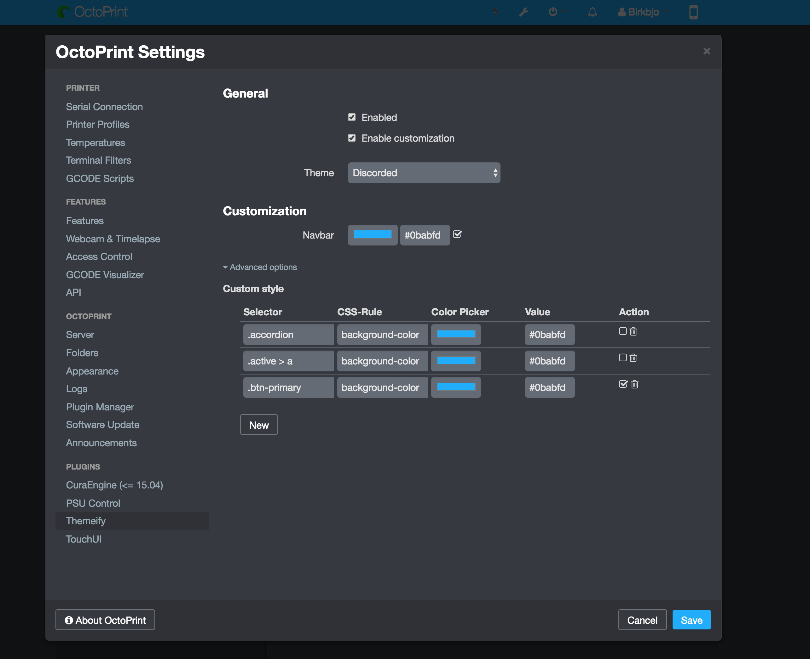

# OctoPrint-Themeify

A small [OctoPrint](https://github.com/foosel/OctoPrint) plugin to change the looks of OctoPrint!
Currently features a beautiful Dark Theme inspired by Discord's color [palette](https://discordapp.com/branding), along with a handful of others thanks to the awesome contributors.

Also features customization of individual elements. With the advanced-customization scheme you can modify the appearance to your heart's desire directly from the settings-dialog!



## Setup

Install via the bundled [Plugin Manager](https://github.com/foosel/OctoPrint/wiki/Plugin:-Plugin-Manager) by searching for "Themify", or
manually enter this URL:

    https://github.com/birkbjo/OctoPrint-Themeify/archive/master.zip


If you don't see the styled header bar, go into Settings -> Appeareance and set Color to "default" and uncheck "Transparent Color".

## Contribute

Contributions are always welcome, especially new themes!

The Javascript and Less are compiled and bundled with webpack.
The reason for this is to be able to use new JS features and have one place to build both the less and JS.

### Getting started

Get NodeJS: https://nodejs.org/en/

Clone the repo:
```bash
git clone https://github.com/Birkbjo/OctoPrint-Themeify.git
cd OctoPrint-Themeify
```

Use npm install or [install yarn](https://yarnpkg.com/lang/en/docs/install/#windows-tab)

```bash
yarn install && yarn build
```

Install the plugin into your octoprint instance:
```
octoprint dev plugin:install
```
Start hacking! 

If you edit the javascript, I advise to use
```bash
yarn watch
```
so that you do not need to build for every change.

If you have setup `stylesheet: less` in your `config.yaml` you can edit the less-files and reload the page without re-building for each change.

#### Build

Build javascript and css:
```bash
yarn build
```
